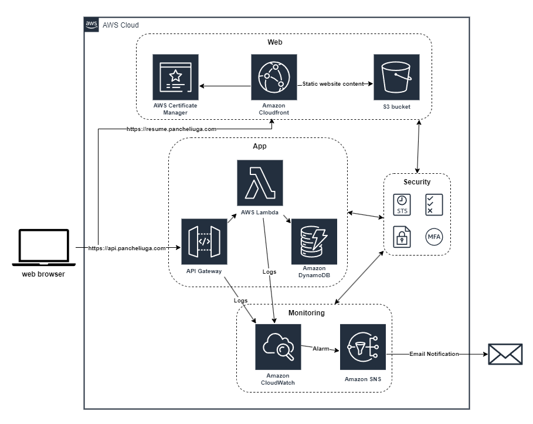

# Cloud Resume Challenge

 

The Architecture diagram

The **[Cloud Resume Challenge](https://cloudresumechallenge.dev/)** is an initiative by [Forrest Brazeal](https://forrestbrazeal.com/) to help individuals advance their cloud careers. The challenge is simple but effective: create a personal resume website and host it on the cloud. However, the real value of this project lies in the skills and experience you gain along the way.

In this repository, you'll find all the resources and code related to my Cloud Resume Challenge journey.

## Table of Contents

- [Project Overview](#project-overview)
- [Technology Stack](#technology-stack)
- [Project Structure](#project-structure)
- [License](#license)

## Project Overview

The Cloud Resume Challenge is a unique project in the tech world. It's not a tutorial or a step-by-step guide. Instead, it's a project specification that encourages you to create a personal resume website using cloud resources. It's an opportunity to apply best practices in cloud technology, development, and DevOps.

### Technology Stack

The Cloud Resume Challenge exposed me to a wide-ranging technology stack, including:

- **Eleventy Static Site Generator**

  For building the front end of my cloud-hosted resume, I leveraged _**[11ty](https://www.11ty.dev/)**_. I began with a _**[template for an online résumé](https://github.com/maxboeck/resume)**_, which provides excellent features like fully customizable design, semantic HTML, accessibility (WCAG AA compliance), print styles, and h-resume microformat. It also embraced search engine optimization with meta tags and JSON-LD, all while ensuring critical CSS inlining.

- **AWS Services**

  I utilized AWS services to make my resume available to the world. _**AWS S3**_ was the hosting platform for the static production build, while _**CloudFront**_ distributed the content globally. _**Amazon Certificate Manager**_ facilitated the issuance of certificates for my custom DNS domain name. This allowed me to bring my resume under the URL of ==resume.pancheliuga.com.==

- **DynamoDB and Lambda**

  For creating a cloud-based API, I used _**DynamoDB**_ as the database, specifically focusing on tracking website visitors. _**Python Lambda functions**_ managed the application logic, ensuring a smooth and reliable user experience.

- **API Gateway**

  An integral part of my cloud architecture, _**API Gateway**_ served as the endpoint for HTTPS API calls and resource handling, such as tracking visitor counts.

- **Terraform for Infrastructure as Code**

  _**Terraform**_ played a crucial role in automating the deployment of resources. It allowed me to define the entire architecture declaratively, making the process safe and repeatable. The IaC was divided into two modules: web (frontend) and app (backend), simplifying the deployment process. Terraform backends were configured using S3 to maintain the environment state across commits.

- **GitHub Actions for CI/CD**

  The source code for the Cloud Resume Challenge was hosted on _**GitHub**_, enabling open-source collaboration and version control. _**GitHub Actions**_ facilitated continuous integration and deployment. Any changes pushed to the main branch triggered the application of Terraform configurations to the production environment. I also implemented the concept of _**Preview environments**_, which are temporary environments created by CI/CD pipelines for new pull requests. These environments allowed for demonstrating feature changes and ensuring the project's integrity before merging with the main branch and deploying to production.

- **Logging and Monitoring with CloudWatch**

  _**CloudWatch**_ played a vital role in ensuring the health and performance of the application. It enabled me to set up alarms that triggered notifications in case of anomalies, including extended response times or errors in the Lambda function.

- **Testing with Cypress**

  To ensure the reliability and functionality of the application, I implemented _**Cypress**_ for end-to-end testing. This involved creating test cases to cover various scenarios, ensuring that both my website and API behaved as expected.

## Project Structure

The Cloud Resume Challenge project is organized as a monorepo, with the following folder structure:

- `.github/workflows`: This folder contains GitHub Actions workflows, used for continuous integration and deployment.

- `app`: The "app" directory encompasses the backend code and AWS Lambda functions responsible for handling the cloud-based API and visitor tracking.

- `infrastructure`: The "infrastructure" directory holds Terraform configurations and scripts for defining and provisioning the cloud resources required for the project.

- `test`: Within the "test" directory, you can find test scripts and files, including Cypress end-to-end testing.

- `web`: The "web" directory houses the front-end code for the cloud-hosted resume, built with a Static Site Generator - 11ty.

## License

This project is licensed under the [MIT License](LICENSE).

---

[My Cloud-Hosted Resume](https://resume.pancheliuga.com)
